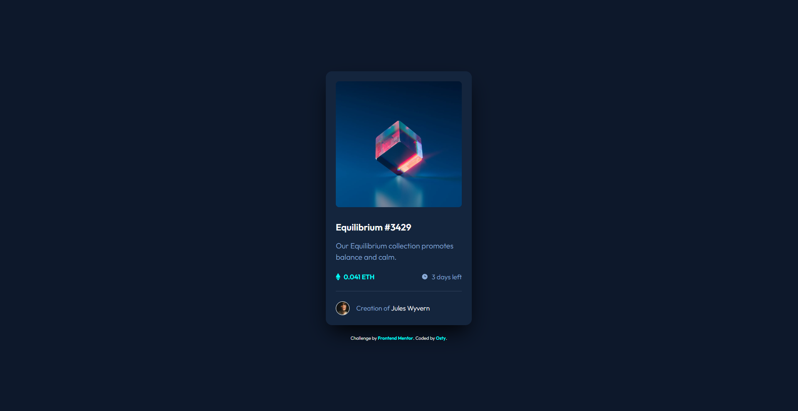

# Frontend Mentor - NFT preview card component solution

This is a solution to the [NFT preview card component challenge on Frontend Mentor](https://frontendmentor.io). Frontend Mentor challenges help you improve your coding skills by building realistic projects.

## Table of contents
- [Overview](#overview)
  - [The challenge](#the-challenge)
  - [Screenshots](#screenshots)
  - [Links](#links)
- [My process](#my-process)
  - [Built with](#built-with)
  - [What I learned & Key Challenges](#what-i-learned--key-challenges)
  - [Project Estimation & Retrospective](#project-estimation--retrospective)
- [Author](#author)

## Overview

### The challenge
Users should be able to:
- View the optimal layout depending on their device's screen size (Desktop, Tablet, and Mobile).
- See interactive hover and keyboard focus states for all interactive targets.
- Navigate and activate all interactive links seamlessly using only keyboard navigation (`Tab` and `Enter`).

### Screenshots
  
*Fig 1. Final look of my responsive NFT preview card component using production-ready SCSS compilation and accessibility-focused focus-visible states.*

### Links
- Solution URL: [Solution Link](https://github.com/Osty-trainee/NFT-preview-card-component)
- Live Site URL: [Live Site Link](https://osty-trainee.github.io/NFT-preview-card-component/)

## My process

### Built with
- Semantic HTML5 markup (`<main>` structural wrapper, native `<a>` anchor tags for interactive containers, and `<span>` text nodes).
- CSS Custom Properties (`:root`) acting as a single source of truth for design tokens, system padding metrics, and color palettes.
- Modular Sass/SCSS architecture dividing code blocks into dedicated system layers (`_fonts`, `_variables`, `_reset`, `main.scss`) using compiled imports.
- Pure Flexbox alignment modules ensuring perfect multi-axis centering for both global viewports and internal component vectors.
- Nested SCSS structure mapping cleanly to standard HTML component hierarchies.
- Safe Git repository state tracking, locking raw assets while excluding local environment artifacts via an optimized `.gitignore` file.

### What I learned & Key Challenges

This project featured clean UI layouts and precise hover overlays that exposed a few interesting architectural bugs and accessibility alignment challenges:

1. **The Image Overlay Hover Misalignment:**
   During the setup of the interactive hover state over the main NFT image, separating the hover selectors caused rendering flickering and alignment breakages. To ensure a solid state transition, I bound the hover logic to the parent `.image-container` block instead of the isolated image layer. This forces both the image opacity drop and the overlay icon reveal to trigger simultaneously without layout jumping:
   ```scss
   .image-container {
       position: relative;
       background-color: var(--cyan-400);

       &:hover,
       &:focus-within {
           .main-image { opacity: 0.5; }
           .overlay { opacity: 1; }
       }
   }
   ```

2. **The Creator Component Nesting Bug:**
   While building the creator info block, a selector mismatch broke the text styles. The `.creator-name` anchor tag was nested parallel to `.creator-text` inside the SCSS tree, whereas the HTML architecture required it to be nested inside the text node block. Fixing the SCSS hierarchy instantly restored proper typographic inheritance and hover states:
   ```scss
   .creator {
       display: flex;
       
       .creator-text {
           color: var(--blue-500);

           .creator-name {
               color: var(--white);
               &:hover { color: var(--cyan-400); }
           }
       }
   }
   ```

3. **Keyboard Accessibility (A11y) for Non-Standard Containers:**
   By default, wrapping an image container inside an asset grid completely skips keyboard tab tracking. To fix this and meet high accessibility standards, the image container and author fields were rebuilt using semantic `<a>` anchor elements. Custom `:focus-visible` dashed and solid tracking outlines were added, ensuring keyboard users receive perfect visual feedback:
   ```scss
   .image-container:focus-visible {
       outline: 3px solid var(--cyan-400);
       outline-offset: 4px;
   }
   ```

## Project Estimation & Retrospective
- **Initial Estimation:** 1 to 2 hours.
- **Actual Time Taken:** ~ 2.5 hours (including local font asset mapping, SCSS hierarchy refactoring, and keyboard tab-navigation flow testing).

**Retrospective Summary:**  
While this design shares identical layout metrics on both desktop and mobile viewports, keeping the card structure responsive via CSS `max-width` guarantees seamless cross-device compatibility. Building interactive elements using semantic links rather than unmapped `<div>` wrappers makes global styling a bit trickier but provides proper keyboard focus targets. This ensures optimal design consistency across all digital viewports.

## Author

- GitHub - [@Osty-trainee](https://github.com)
- Frontend Mentor - [@Osty-trainee](https://frontendmentor.io)
